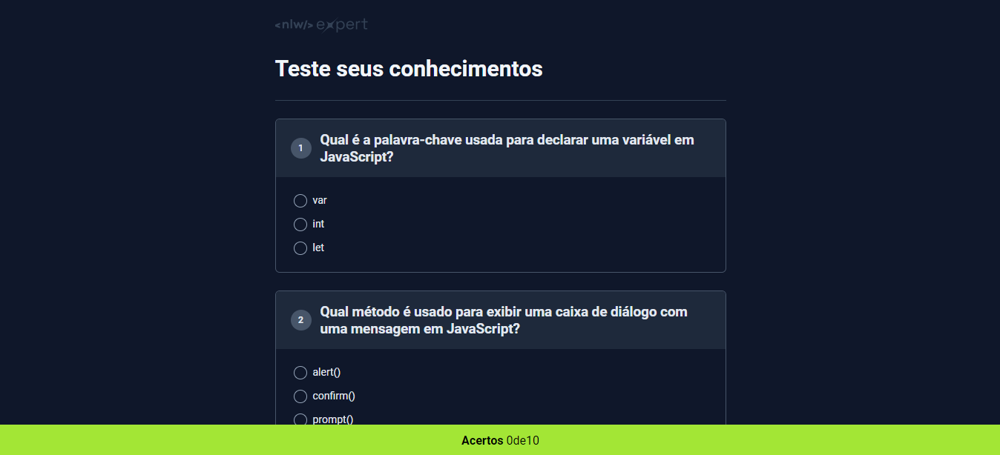

- Durante os dias do evento, tive a oportunidade de desenvolver um projeto inédito, explorar novas tecnologias na prática e aprimorar minhas habilidades
como desenvolvedora. Além disso, pude participar de uma comunidade exclusiva, compartilhando conhecimentos e experiências com outros participantes e mentores.

  ## Tecnologia Utilizadas
  - HTML
  - CSS
  - JavaScript
  - Github
  - link do Projeto:

##

 
- O Next Level Week acontece poucas vezes no ano, com datas definidas para início e término. Cada edição apresenta um tema e desafio diferentes, 
o que torna cada experiência única e estimulante. Estou muito grato por ter participado e mal posso esperar pela próxima edição do Next Level Week.
